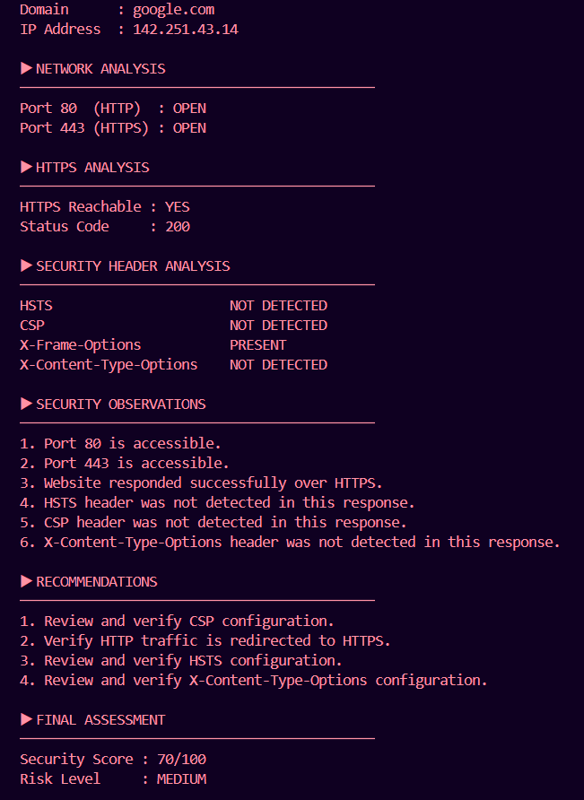
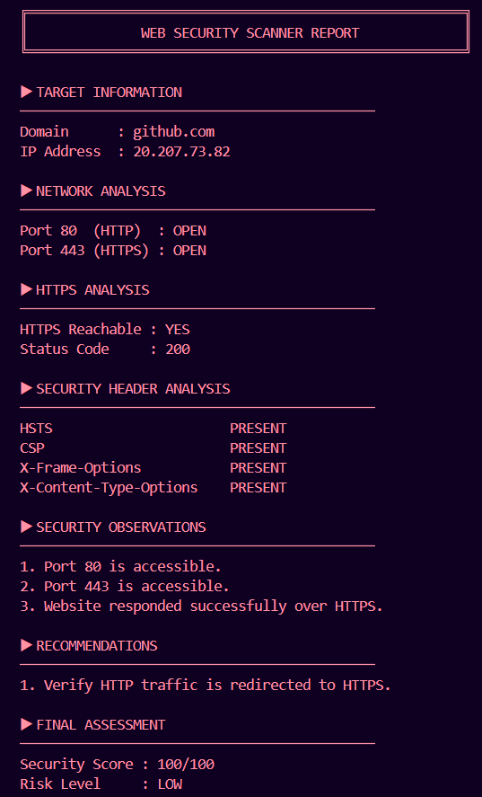
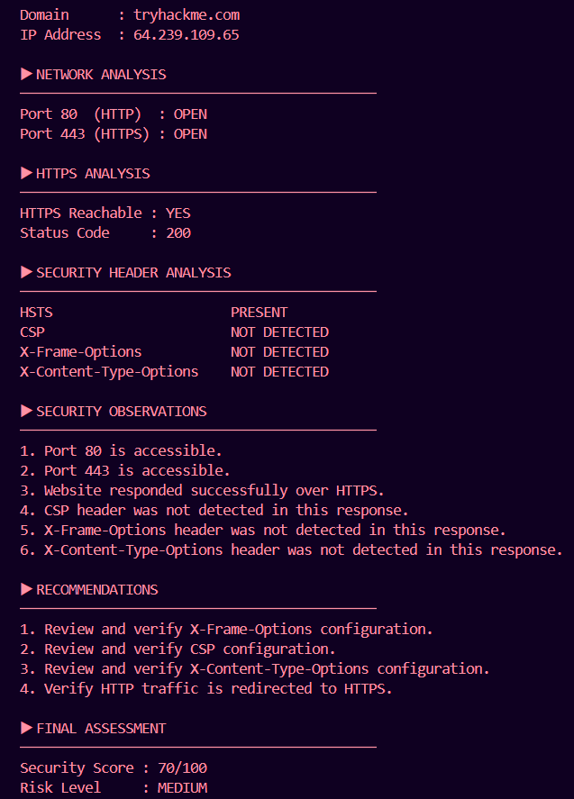

# Web Security Scanner

A Python-based web security assessment tool that analyzes website connectivity, HTTPS availability, open ports, and security headers.

## Features

- Domain Resolution
- Port Analysis
- HTTPS Verification
- Security Header Analysis
- Security Score Calculation
- Security Recommendations

## Technologies Used

- Python
- Requests
- Socket Programming

## Installation

```bash
pip install -r requirements.txt
```

## Usage

```bash
python3 security_scanner.py
```

## Sample Output

### Google Scan



### GitHub Scan



### TryHackMe Scan



